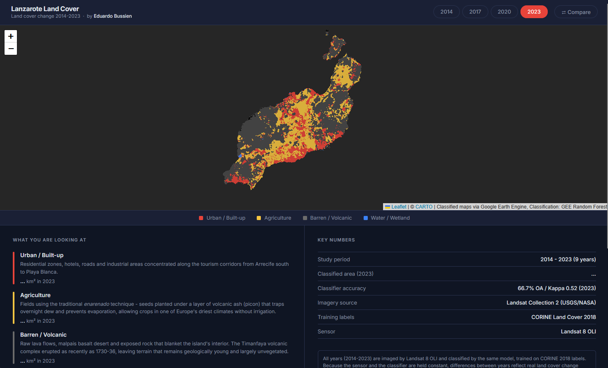
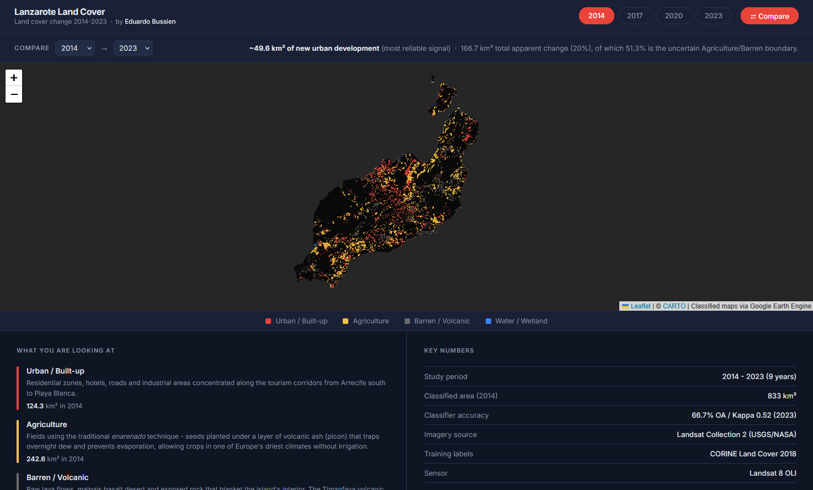

# Lanzarote Land Cover Change (2014-2023)

An end-to-end geospatial machine learning project that maps how land cover changed on **Lanzarote** (Canary Islands, Spain) between 2014 and 2023, using Landsat 8 satellite imagery, Google Earth Engine, and a Random Forest classifier - served through a FastAPI backend and an interactive web map.

Built by **Eduardo Bussien** · [GitHub](https://github.com/eduardobussien) · [LinkedIn](https://www.linkedin.com/in/eduardo-bussien-805a1626a)



---

## What it does

The app classifies every 30 m pixel of the island into four land cover types - **Urban/Built-up, Agriculture, Barren/Volcanic, and Water/Wetland** - for each year from 2014 to 2023, and lets you:

- **Browse any year** and read the area (km²) of each class
- **Compare two years** side by side as a *change map*, showing only the pixels that changed class, colored by what they became
- See an **honest accuracy breakdown** so you know which numbers to trust

Every year is imaged by the **same satellite** (Landsat 8) and classified by the **same model** (trained on CORINE 2018), so year-to-year differences reflect real land cover change rather than a change of method.

## Key finding

Over nine years, **built-up area grew from 124.3 km² to 144.3 km² - a ~16% increase** - concentrated along the tourism corridor from Arrecife south to Playa Blanca. Urban is the most spectrally distinct class, making this the project's most reliable result.

| Class | 2014 | 2023 | Change |
|---|---:|---:|---:|
| Urban / Built-up | 124.3 km² | **144.3 km²** | **+16%** |
| Agriculture | 242.6 km² | 261.8 km² | +8% *(uncertain)* |
| Barren / Volcanic | 463.7 km² | 422.8 km² | −9% *(uncertain)* |
| Water / Wetland | ~4 km² | 3.7 km² | ~flat |

The Agriculture and Barren figures are marked *uncertain* on purpose - see [Accuracy & limitations](#accuracy--limitations).

## Compare mode



The change map isolates the ~166 km² of apparent change and splits it into the part you can trust and the part you can't: **~50 km² of new urban development** (reliable) versus the **~51% of change that is the uncertain Agriculture/Barren boundary**.

---

## How it works

```
Landsat 8 (Google Earth Engine)                CORINE Land Cover 2018
   surface reflectance, dry season                training labels
              │                                         │
              ▼                                         ▼
   6 bands + 7 spectral indices  ──►  Random Forest classifier (200 trees)
   (NDVI, NDWI, NDBI, SAVI, BSI, EVI, MNDWI)            │
              │                                         ▼
              │                          4-class map + 3×3 majority filter
              ▼                                         │
        FastAPI backend  ◄──── live tile / area / change endpoints
              │
              ▼
     Leaflet + vanilla-JS frontend (this app)
```

- **Imagery:** Landsat Collection 2 Level-2 Surface Reflectance, cloud-masked dry-season (May-Sep) median composites, computed server-side in Google Earth Engine (no rasters downloaded).
- **Features:** the six optical bands plus seven spectral indices that separate vegetation, water, built-up, and bare surfaces.
- **Classifier:** a Random Forest (200 trees) trained on CORINE 2018 labels. Overall accuracy **66.7%**, Kappa **0.52**.
- **Post-processing:** a 3×3 majority filter removes isolated salt-and-pepper noise, while *preserving* raw Urban pixels so new development is not smoothed away.
- **Backend:** FastAPI serves live GEE tile URLs, per-year class areas, and two-year change maps. Classifier training and initialization are locked and cached; the blocking GEE calls run unlocked so requests are not serialized.
- **Frontend:** plain HTML/CSS/JS with Leaflet - no framework.

## Accuracy & limitations

This project deliberately reports its own uncertainty rather than hiding it.

- **~1 in 3 pixels may be mislabelled** (66.7% overall accuracy), and that error concentrates almost entirely on one pair: **Agriculture vs Barren**. On Lanzarote, crops are grown *under* volcanic ash (the *enarenado* technique), so farmland and bare lava reflect nearly identical light - even a human struggles to tell them apart from 30 m imagery.
- **Urban/Built-up is the reliable class** because concrete and asphalt are spectrally distinct, so the urban-growth headline is the most trustworthy number.
- **Consistency by design:** using one sensor and one classifier for all years means the *differences* between years are real change, not an artefact of switching methods. (Earlier notebooks that reach back to 1990 across multiple Landsat sensors showed exactly why a single-sensor window is necessary.)
- **What would improve it:** 10 m Sentinel-2 imagery, field-collected ground truth, or per-class temporal smoothing - each a larger undertaking than free Landsat + CORINE allows.

## Tech stack

**Python** · Google Earth Engine · scikit-learn / GEE `smileRandomForest` · FastAPI · Uvicorn · pandas · **JavaScript** · Leaflet · Jupyter

## Running it locally

Requires Python 3.12+ and a Google Earth Engine account.

```bash
pip install -r requirements.txt
earthengine authenticate          # one-time GEE sign-in
python -m uvicorn backend.main:app --reload --host 0.0.0.0 --port 8000
```

Then open **http://localhost:8000/**. The first request per sensor trains the classifier (~30-60 s); results are cached after that.

Set your GEE project id in `pipeline/config.py` (`GEE_PROJECT`).

## Project structure

```
backend/      FastAPI app - GEE service, tile/area/change endpoints
frontend/     Leaflet + vanilla-JS single-page map
pipeline/     Reusable GEE + classification helpers, spectral indices, config
notebooks/    01 exploration · 02 indices · 03 classification · 04 change · 05 results
docs/         Methodology, architecture, accuracy notes, screenshots
```

## License

See [LICENSE](LICENSE).
