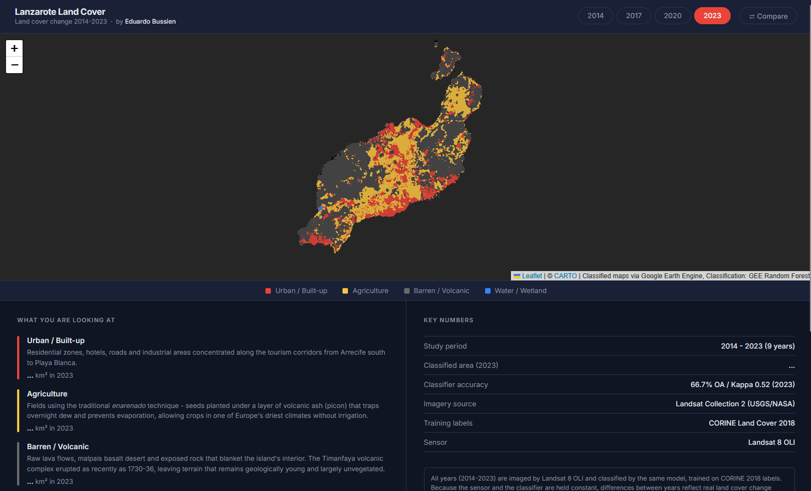
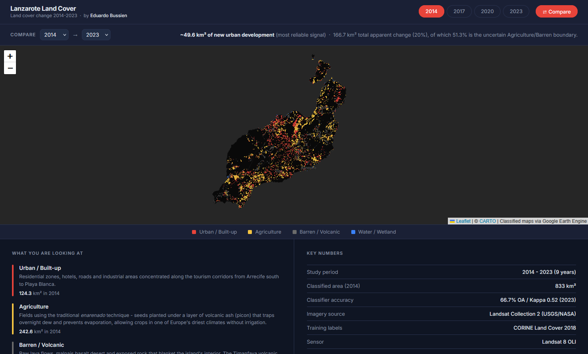

# Lanzarote Land Cover Change (2014-2023)

An end-to-end geospatial machine learning project that maps how land cover changed on **Lanzarote** (Canary Islands, Spain) between 2014 and 2023, using Landsat 8 satellite imagery, Google Earth Engine, and a Random Forest classifier - served through a FastAPI backend and an interactive web map.

Built by **Eduardo Bussien** · [GitHub](https://github.com/eduardobussien) · [LinkedIn](https://www.linkedin.com/in/eduardo-bussien-805a1626a)



---

## What it does

The app classifies every 30 m pixel of the island into four land cover types - **Urban/Built-up, Agriculture, Barren/Volcanic, and Water/Wetland** - for each year from 2014 to 2023, and lets you:

- **Browse any year** and read the area (km²) of each class
- **Compare two years** side by side as a *change map*, showing only the pixels that changed class, colored by what they became
- See an **honest accuracy breakdown** so you know which numbers to trust

Every year is imaged by the **same satellite** (Landsat 8) and classified by the **same model** (trained on CORINE 2018), so year-to-year differences reflect real land cover change rather than a change of method.

## Key finding

Over nine years, **built-up area grew from 124.3 km² to 144.3 km² - a ~16% increase** - concentrated along the tourism corridor from Arrecife south to Playa Blanca. Both years are classified by the same model, so errors that repeat in both years largely cancel out in the comparison; the individual yearly figures are estimates.

| Class | 2014 | 2023 | Change |
|---|---:|---:|---:|
| Urban / Built-up | 124.3 km² | **144.3 km²** | **+16%** |
| Agriculture | 242.6 km² | 261.8 km² | +8% |
| Barren / Volcanic | 463.7 km² | 422.8 km² | −9% |
| Water / Wetland | ~4 km² | 3.7 km² | ~flat |

Every class has a similar per-pixel accuracy of roughly 70%, so read all of these figures as estimates - see [Accuracy & limitations](#accuracy--limitations).

## Compare mode



The change map isolates the ~166 km² of apparent change and breaks it down. For 2014 → 2023, **urban grew by a net +20 km²**: 49.6 km² of pixels became urban and 29.5 km² stopped being urban. Real demolition is rare, so much of that back-and-forth is classifier noise flickering pixels in and out of the class. That noise inflates the gain and the loss equally, so the net figure cancels it out (and it matches the per-year totals, 124.3 → 144.3 km²). Meanwhile **~51% of all apparent change is pixels switching between Agriculture and Barren**, one of the model's main confusions.

---

## How it works

```
Landsat 8 (Google Earth Engine)                CORINE Land Cover 2018
   surface reflectance, dry season                training labels
              │                                         │
              ▼                                         ▼
   6 bands + 7 spectral indices  ──►  Random Forest classifier (200 trees)
   (NDVI, NDWI, NDBI, SAVI, BSI, EVI, MNDWI)            │
              │                                         ▼
              │                          4-class map + 3×3 majority filter
              ▼                                         │
        FastAPI backend  ◄──── live tile / area / change endpoints
              │
              ▼
     Leaflet + vanilla-JS frontend (this app)
```

- **Imagery:** Landsat Collection 2 Level-2 Surface Reflectance, cloud-masked dry-season (May-Sep) median composites, computed server-side in Google Earth Engine (no rasters downloaded).
- **Features:** the six optical bands plus seven spectral indices that separate vegetation, water, built-up, and bare surfaces.
- **Classifier:** a Random Forest (200 trees) trained on CORINE 2018 labels. Held-out accuracy **68.9%**, Kappa **0.55** (agreement with CORINE; reproduce with `scripts/evaluate_accuracy.py`).
- **Post-processing:** a 3×3 majority filter removes isolated salt-and-pepper noise (it raises held-out accuracy from 67.7% to 68.9%), while *preserving* raw Urban pixels so small new development is not smoothed away. The trade-off: it also keeps some false Urban speckle.
- **Backend:** FastAPI serves live GEE tile URLs, per-year class areas, and two-year change maps. Classifier training and initialization are locked and cached; the blocking GEE calls run unlocked so requests are not serialized.
- **Frontend:** plain HTML/CSS/JS with Leaflet - no framework.

## Accuracy & limitations

This project deliberately reports its own uncertainty rather than hiding it.

- **Measured accuracy: 68.9% (Kappa 0.55)** for the filtered map the app shows, scored on 715 held-out points the model never trained on (`scripts/evaluate_accuracy.py`). So roughly **1 in 3 pixels disagree with the reference map**. With 715 test points, that figure itself is uncertain by about ±3.4 points.
- **Errors are spread across Urban, Agriculture and Barren**, not concentrated in one pair:

  | Class | Recall (share of the class we find) | Precision (how often a pixel we label is right) | Test points |
  |---|---:|---:|---:|
  | Urban / Built-up | 71% | 69% | 222 |
  | Agriculture | 70% | 65% | 226 |
  | Barren / Volcanic | 65% | 71% | 240 |
  | Water / Wetland | 77% | 83% | 26 |

  On Lanzarote, bare lava, *enarenado* farmland (crops grown *under* volcanic ash) and built-up land all reflect similar light at 30 m, so the model mixes them up in every direction. Water has only 26 test points - far too few for a firm estimate.
- **It is agreement with CORINE, not ground truth.** CORINE maps blocks of at least 25 ha, so its "urban" includes gardens, roads and open plots that genuinely look like rock or farmland at 30 m - some disagreements are CORINE generalising, not the model failing. The test points were split randomly rather than by area, so neighbouring train/test points likely make the score somewhat optimistic.
- **Consistency by design:** using one sensor and one classifier for all years means the *differences* between years are real change, not an artefact of switching methods. (Earlier notebooks that reach back to 1990 across multiple Landsat sensors showed exactly why a single-sensor window is necessary.)
- **What would improve it:** cleaner training labels (dropping ambiguous CORINE categories such as mines, construction sites and "agriculture with significant natural vegetation"), validation split by area instead of at random, 10 m Sentinel-2 imagery, or field-collected ground truth.

## Tech stack

**Python** · Google Earth Engine · scikit-learn / GEE `smileRandomForest` · FastAPI · Uvicorn · pandas · **JavaScript** · Leaflet · Jupyter

## Running it locally

Requires Python 3.12+ and a Google Earth Engine account.

```bash
pip install -r requirements.txt
earthengine authenticate          # one-time GEE sign-in
python -m uvicorn backend.main:app --reload --host 0.0.0.0 --port 8000
```

Then open **http://localhost:8000/**. The first request per sensor trains the classifier (~30-60 s); results are cached after that.

Set your GEE project id in `pipeline/config.py` (`GEE_PROJECT`).

## Project structure

```
backend/      FastAPI app - GEE service, tile/area/change endpoints
frontend/     Leaflet + vanilla-JS single-page map
pipeline/     Reusable GEE + classification helpers, spectral indices, config
notebooks/    01 exploration · 02 indices · 03 classification · 04 change · 05 results
docs/         Methodology, architecture, accuracy notes, screenshots
```

## License

See [LICENSE](LICENSE).
